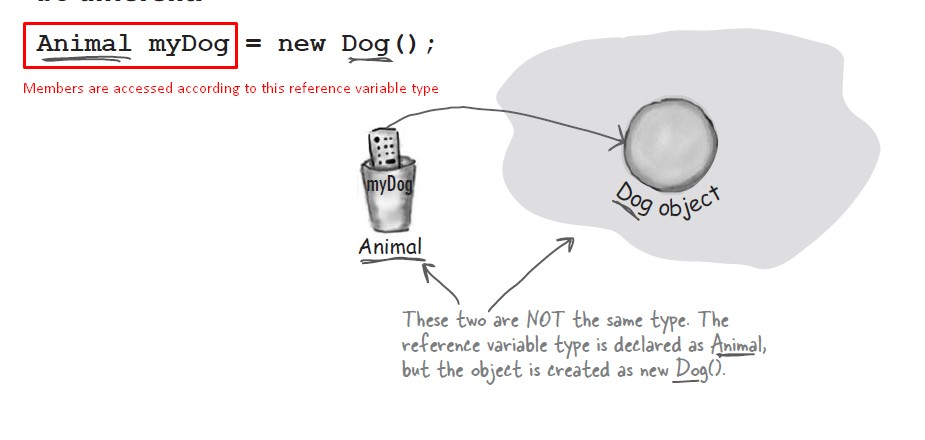

# Java Summary Sheet

- [Java Summary Sheet](#java-summary-sheet)
- [Get to know the Java API](#get-to-know-the-java-api)
	- [Working with ArrayList](#working-with-arraylist)
	- [Boolean Operators](#boolean-operators)
		- [Non Short Circuit Operators ( \& , | )](#non-short-circuit-operators-----)
		- [Packages](#packages)
- [Inheritance and Polymorphism](#inheritance-and-polymorphism)
	- [Polymorphism](#polymorphism)
		- [Not all classes can be inherited](#not-all-classes-can-be-inherited)
		- [Overriding](#overriding)
		- [Overloading](#overloading)
- [Interfaces and Abstract classes](#interfaces-and-abstract-classes)
	- [Abstract Class](#abstract-class)
		- [Abstract methods](#abstract-methods)
		- [Object](#object)

# Get to know the Java API

## Working with ArrayList
```java
// Make one
ArrayList<Egg> myList = new ArrayList<Egg>();

// Put something in it
Egg s = new Egg();
myList.add(s);

//Remove something from it
myList.remove(s);

// Find out how many things are in it
int theSize = myList.size();

// Find out if it contains something
boolean isIn = myList.contains(s);

// Find out if it’s empty
boolean empty = myList.isEmpty();

// Find out where something is (i.e. its index)
int idx = myList.indexOf(b);

// Put another thing in it
Egg b = new Egg();
myList.add(b);
```

## Boolean Operators

* In the case of &&, if the JVM sees that the left side of a && expression is false, it stops right there! Doesn’t even bother to look at the right side. Similar is the case with || .

### Non Short Circuit Operators ( & , | )
* When used in boolean expressions, the & and | operators act like their && and || counterparts, except that they force the JVM to always check both sides of the expression. Typically, & and | are used in another context, for manipulating bits.

### Packages
* They help the overall organization of a project or library
* Packages give you a namescoping, to help prevent collisions for a class with the same name
* Packages provide a level of security, because you can restrict the code you write so that only other classes in the same package can access it
* classes in java.lang package don't need to be imported (for ex. java.lang.String)

# Inheritance and Polymorphism

* the subclass inherits the members (the instance variables and methods) of the superclass
* methods can be overriden by subclass but Instance variables are not overridden (because they don’t need to be)
* In Java, we say that **the subclass extends the superclass**


```java

public class Doctor {
	boolean worksAtHospital;

	void treatPatient() {
// perform a checkup
	}
}

public class FamilyDoctor extends Doctor {
	boolean makesHouseCalls;

	void giveAdvice() {
// give homespun advice
	}
}

public class Surgeon extends Doctor {
	void treatPatient() {
// perform surgery
	}

	void makeIncision() {
// make incision (yikes!)
	}
}

```

* Only public members are inherited and private are not.
* Use the IS-A test to verify that your inheritance hierarchy is valid. If X extends Y, then X IS-A Y must make sense.

## Polymorphism

```java
Animal[] animals = new Animal[5];
animals [0] = new Dog();
animals [1] = new Cat();
animals [2] = new Wolf();
animals [3] = new Hippo();
animals [4] = new Lion();

for (int i = 0; i < animals.length; i++) {
	//When ‘i’ is 0, you get the Dog’s eat() method. When ‘i’ is 1, you get the Cat’s eat() method
	animals[i].eat();	
	animals[i].roam();
}
```

* You can have polymorphism with arguments and return types also
```java
// Polymorphism in methods

class Vet {
	public void giveShot(Animal a) {
// do horrible things to the Animal at
// the other end of the ‘a’ parameter
		a.makeNoise();
	}
}

class PetOwner {
	public void start() {
		Vet v = new Vet();
		Dog d = new Dog();
		Hippo h = new Hippo();
		v.giveShot(d); // Dog’s makeNoise() runs
		v.giveShot(h); // Hippo’s makeNoise() runs
	}
}
```


### Not all classes can be inherited
* There’s no such thing as a private class, except in a very special case called an inner class, that we haven’t looked at yet
> #### Things that can prevent a class from being subclassed
* Even though a class can’t be marked private, a class can be non-public (what you get if you don’t declare the class as public). A non-public class can be subclassed only by classes in the same package as the class. Classes in a different package won’t be able to subclass (or even use, for that matter) the non-public class
* The second thing that stops a class from being subclassed is the keyword modifier final. A final class means that it’s the end of the inheritance line. Nobody, ever, can extend a final class
* The third issue is that if a class has only private constructors

* If you want to protect a specific method from being overridden, mark the method with the final modifier. Mark the whole class as final if you want to guarantee that none of the methods in that class will ever be overridden.

### Overriding
* Arguments must be the same, and return types must be compatible.
* The method can’t be less accessible.

### Overloading
* Arguments lists have to be different

# Interfaces and Abstract classes

## Abstract Class
* You can make some classes abstract that don't need to be instantiated and only used for inheritance
```java
//Example of an abstract class that has abstract and non-abstract methods  
abstract class Bike {
	Bike() {
		System.out.println("bike is created");
	}

	abstract void run();

	void changeGear() {
		System.out.println("gear changed");
	}
}

//Creating a Child class which inherits Abstract class  
class Honda extends Bike {
	void run() {
		System.out.println("running safely..");
	}
}
```
* non abstract classes sometimes known as concrete classes

### Abstract methods

> * An abstract class can have both abstract and non-abstract methods
> * If a class has even one abstract method, the class must be marked abstract
> * An abstract method has no body, and the declaration ends with a semicolon (no
curly braces)
> * All abstract methods must be implemented in the first concrete subclass in the inheritance tree

### Object
* Any class that doesn’t explicitly extend another class, implicitly extends *Object* class.
* Every class in Java is either a direct or indirect subclass of class Object (java.lang.
Object)
* Mainly, Object has 4 members : 
```java
boolean equals()	// compares the given object to this object
Class getClass() 	// returns the Class class object of this object
int hashCode() 		// returns the hashcode number for this object
String toString()	// returns the string representation of this object

// hashCode(), equals(), and toString() can be overridden but getClass can't
```
* Object can be used as a polymorphic type for methods that need to work on any class that you or anyone else makes
* But, using object reference has its price. (Because Java is a strongly-typed language) You can call only those methods which are supported by the object reference.
```java
Object o = new Ferrari(); 
o.goFast(); //Not legal!
```


```java
```
Source : [Head First Java 2nd Ed.]